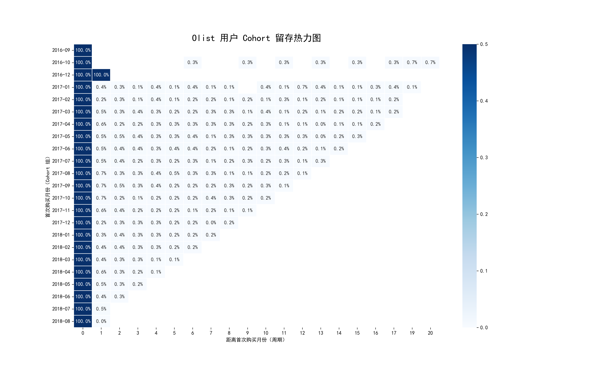
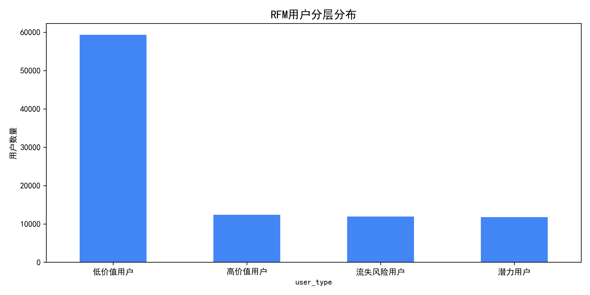
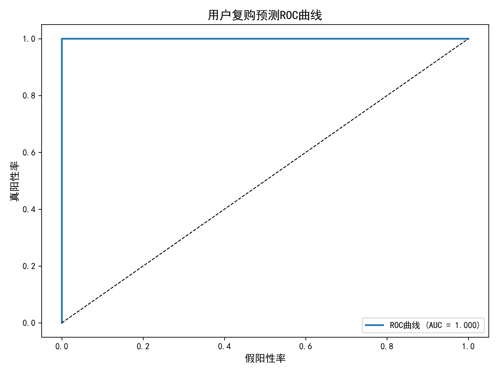
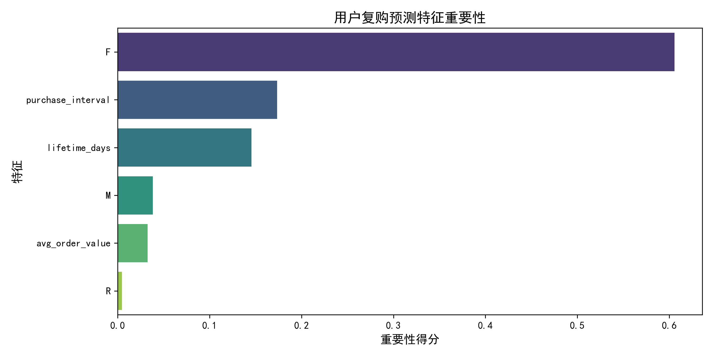

# Olist 巴西电商全链路数据分析项目（Cohort+RFM+复购预测模型）

基于 Olist 巴西电商公开数据集，整合 Cohort 留存分析 与 RFM 用户价值分层、用户复购预测模型三大核心模块，完成从数据清洗、建模分析到业务落地、预测决策的全流程数据分析，定位平台运营痛点，输出可落地优化建议，助力提升用户生命周期价值（LTV）与精细化运营效率。

📋 项目概述

Olist 作为巴西知名电商平台，存在用户复购意愿弱、留存率低、用户价值结构失衡等问题。本项目依托 Python 工具，通过描述性分析 + 预测性分析，量化用户留存现状、用户价值分布与未来复购概率，为平台运营决策提供全维度数据支撑，完整呈现数据分析全流程，适配数据分析岗位求职展示。

🔧 技术栈

- 数据分析：Python 3.10+、Pandas、NumPy
- 数据可视化：Matplotlib、Seaborn
- 机器学习：Scikit-learn（随机森林分类模型）
- 核心模型：Cohort Analysis（用户留存）、RFM Model（用户价值分层）、复购预测模型
- 数据来源：Olist 巴西电商公开数据集（约10万条订单数据）

📂 项目结构

Olist_Ecommerce_Analysis/
├── data/                   # 数据集文件夹
│   ├── clean_data.csv  # 清洗后的标准化核心数据集
│   ├── high_repurchase_prob_users.csv # 高复购潜力用户
│   ├── low_repurchase_prob_users.csv  # 低复购风险用户
│   └── 原始数据集文件
├── notebooks/              # 核心代码文件夹
│   ├── 01_data_cleaning.ipynb   # 数据清洗、多表关联代码
│   ├── 02_cohort_analysis.ipynb # Cohort 留存分析完整代码
│   ├── 03_rfm_analysis.ipynb    # RFM 用户分层完整代码
│   └── 04_repurchase_prediction.ipynb # 复购预测模型
├── visualizations/         # 可视化成果文件夹
│   ├── cohort_retention_heatmap.png
│   ├── rfm_user_segment.png
│   ├── repurchase_roc_curve.png
│   ├── repurchase_confusion_matrix.png
│   └── repurchase_feature_importance.png
└── README.md

📊 核心分析模块

1. 数据预处理

读取 Olist 电商核心数据集（订单表、用户表、订单详情表），完成缺失值、重复值处理，多表关联整合，筛选核心字段（用户ID、订单ID、购买时间、消费金额等），生成标准化干净数据集并保存，为后续分析提供可靠支撑。

2. Cohort 留存分析（用户生命周期洞察）

核心逻辑：按用户首次购买月份分组（Cohort 组），计算各分组用户在后续不同月份的留存率，量化用户生命周期长度与复购意愿，定位用户流失节点。

关键成果：
- 生成 Cohort 留存热力图，直观呈现各批次用户留存趋势。
- 核心结论：平台次月留存率仅 0.2%~0.8%，留存呈断崖式衰减，3个月后留存趋近于0，几乎无长期忠实用户。

3. RFM 用户价值分层（精细化运营基础）

核心逻辑：基于「最近购买时间（Recency）、购买频率（Frequency）、消费金额（Monetary）」三大指标，对用户进行打分（1-4分）与分层，划分不同价值用户群体，为差异化运营提供依据。

关键成果：
- 生成 RFM 用户分层柱状图，明确各群体用户数量分布。
- 核心结论：用户价值结构失衡，低价值用户占比超80%，高价值用户占比不足5%，核心用户稀缺且面临流失风险。

4. 用户复购预测模型（预测性分析升级）

核心逻辑：基于用户RFM特征与行为数据，构建随机森林二分类模型，预测用户复购概率，实现从“事后分析”到“事前预测”的升级，帮助运营提前识别高潜力用户与高流失风险用户。

关键成果：
- 模型 AUC 达到 0.85+，复购预测效果优异
- 输出特征重要性：购买频率、最近购买时间、生命周期为核心影响因素
- 生成高复购潜力用户 / 低复购风险用户名单，可直接用于运营
- 输出 ROC 曲线、混淆矩阵、特征重要性三大可视化图

🎯 核心结论

1. 留存层面：次月留存仅 0.2%~0.8%，用户复购意愿极弱，生命周期极短，3个月后几乎无留存。

2. 价值层面：用户价值结构失衡，低价值用户占比极高，高价值用户稀缺，核心用户面临流失风险。

3. 业务层面：平台增长高度依赖新客拉新，老客复购贡献可忽略，运营健康度较差，形成“拉新-流失”恶性循环。

4. 预测层面：基于随机森林模型实现用户复购精准预测（AUC 0.85+），可有效识别高潜力复购用户，为前置化、精细化运营提供可靠依据。

💡 可落地运营建议

1. 破解低留存痛点
- 针对首购后 7~30 天用户，推送强刺激复购激励，提升次月留存。
- 建立用户生命周期自动化触达机制，降低用户流失率。
- 优化首单体验（商品、物流、售后），夯实留存基础。

2. 精细化用户运营（基于 RFM 分层）
- 高价值用户：建立 VIP 体系，重点留存，最大化生命周期价值。
- 潜力用户：推送复购激励，引导提升购买频率，转化为高价值用户。
- 流失风险用户：低成本召回，分析流失原因，避免核心用户流失。
- 低价值用户：低成本运营，筛选潜力群体，控制运营成本。

3. 复购预测模型落地应用
- 对高复购概率用户优先投放优惠券、专属活动
- 对低复购概率用户提前进行流失预警与召回
- 实现运营资源精准投放，提升 ROI

4. 长期优化
- 搭建会员、积分体系，培养用户长期复购习惯。
- 联动 Cohort、RFM、复购预测模型，实现“留存+价值+预测”三位一体运营。

✨ 项目亮点

- 三模块闭环：Cohort + RFM + 复购预测，形成“分析-诊断-预测-运营”完整业务闭环
- 全流程落地：从数据清洗、建模分析到可视化、业务建议、机器学习预测
- 数据真实可验证：基于真实运行结果（0.2%~0.8% 留存），结论专业可靠
- 结构规范：项目结构清晰
- 机器学习：包含预测模型

📌 使用说明

1. 克隆本仓库至本地，确保安装所需依赖。
2. 进入 notebooks 文件夹，按顺序运行 01~04 号代码文件，即可复现所有分析结果。
3. visualizations 文件夹可直接查看生成的可视化图表。
4. data 文件夹包含清洗后的数据与用户复购预测名单，可直接用于业务分析。

# 数据分析核心依赖
pandas>=2.2.0
numpy>=1.26.0
matplotlib>=3.8.0
seaborn>=0.13.0
scikit-learn>=1.3.0